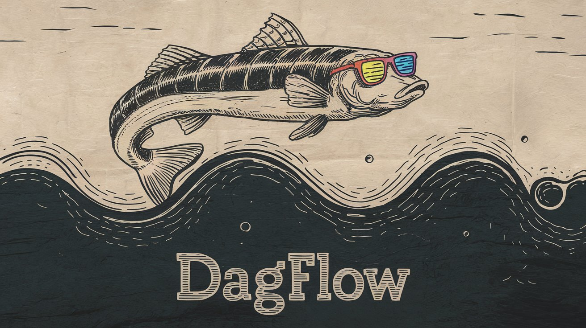
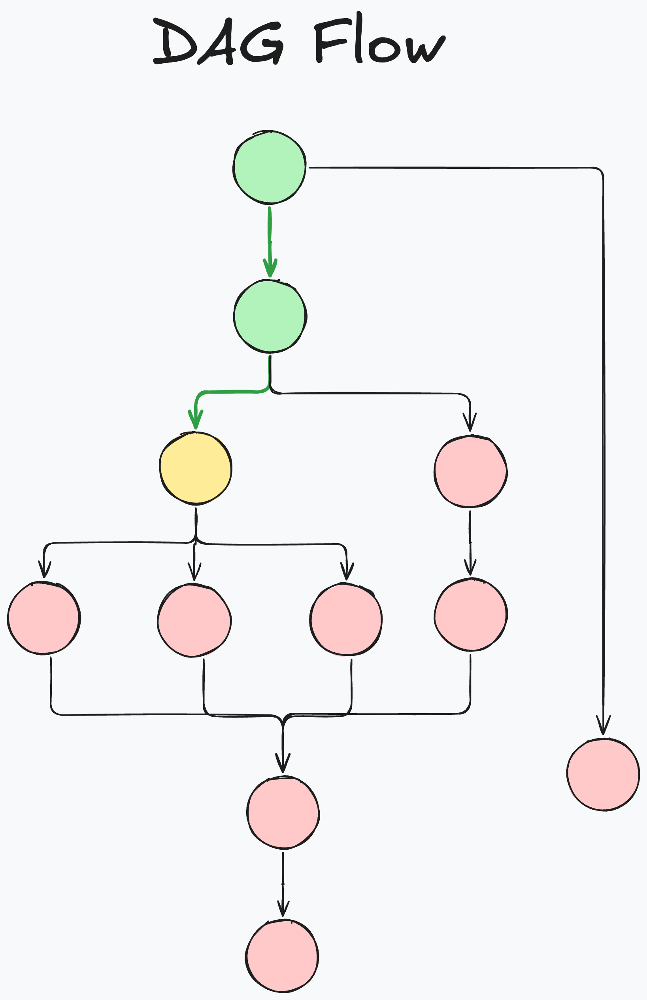
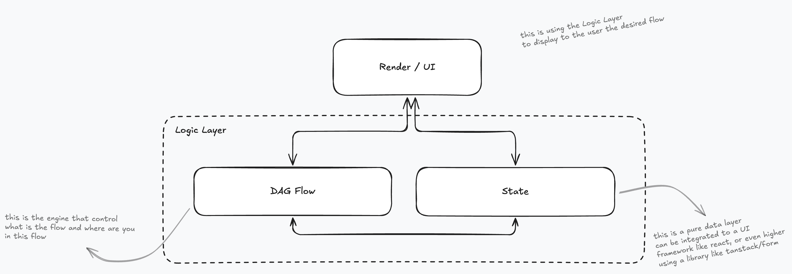

# DAGFlow

A powerful library for managing complex, branching flows with a simple API.

## Overview

DAGFlow is a library that helps you manage complex flows using a Directed Acyclic Graph (DAG) structure that ultimately produces a linear path. It's particularly useful for:

- Multi-step forms with conditional paths
- User onboarding flows
- Interactive questionnaires

## Key Concepts

### DAG for Linear Flow = DAGFlow



A DAG (Directed Acyclic Graph) is a graph where:

- Connections between nodes have a direction
- You can't create cycles (loops)
- You can have multiple paths to reach a destination

DAGFlow adds an important concept on top of a regular DAG: **active paths**. While your flow structure might be complex with many possible paths, at runtime there is always exactly one active path - the sequence of steps the user is currently on.


```
Example DAG structure:
a
 └─ b
     ├─ c
     │   └─ f
     │       └─ z
     ├─ d
     │   ├─ m -> z
     │   └─ n -> z
     └─ e -> z

Possible linear flows:
1. a -> b -> c -> f -> z
2. a -> b -> d -> m -> z
3. a -> b -> d -> n -> z
4. a -> b -> e -> z
```

### Node States

Each node in the flow can be in one of three states:

- 🟡 **Yellow**: The node is active but not yet resolved (waiting for user input)
- 🟢 **Green**: The node has been resolved (user made a choice)
- 🔴 **Red**: The node is not part of the current active path

### Architecture



DAGFlow is designed to be framework-agnostic and can be integrated with any UI or state management solution. The library is split into two main packages:

1. `@tembell/dagflow-core`: The core engine that manages the DAG structure and state
2. `@tembell/dagflow-react`: React bindings for easy integration with React applications

## Installation

```bash
# Install core package
npm install @tembell/dagflow-core

# For React applications
npm install @tembell/dagflow-react
```

## Basic Usage

### Creating a Flow

```typescript
import { DAGFlow } from "@tembell/dagflow-core";

// Create the root node
const flow = new DAGFlow({ id: "start" });

// Build your flow structure
const personalInfo = flow.addChild({ id: "personal-info" });
const employment = personalInfo.addChild({ id: "employment" });
const student = personalInfo.addChild({ id: "student" });

// Add more branches
const employed = employment.addChild({ id: "employed" });
const selfEmployed = employment.addChild({ id: "self-employed" });

// Create shared endpoints
const financial = new DAGFlow({ id: "financial" });
employed.addEdge(financial);
selfEmployed.addEdge(financial);
student.addEdge(financial);
```

### React Integration

```typescript
import { createUseDAGFlow } from '@tembell/dagflow-react';

// Create the hook
const useFlow = createUseDAGFlow(flow);

// Use in your component
function FlowManager() {
  const {
    steps,          // Current active chain of nodes
    resolveById,    // Function to choose next step
    reset,          // Function to reset from a specific point
    dag            // Access to the full DAG structure
  } = useFlow();

  return (
    <div>
      {steps.map(node => (
        <div key={node.id}>
          {/* Render your UI based on node state */}
        </div>
      ))}
    </div>
  );
}
```

## What DAGFlow Doesn't Do

DAGFlow is focused on managing the logical structure and state of your flow. It intentionally doesn't handle:

- UI components (steppers, forms, etc.)
- Animation between steps
- Data persistence
- Form validation
- Navigation logic

These concerns are left to your application code or other specialized libraries.


## Contributing

We welcome contributions! Please see our [Contributing Guide](CONTRIBUTING.md) for details.
